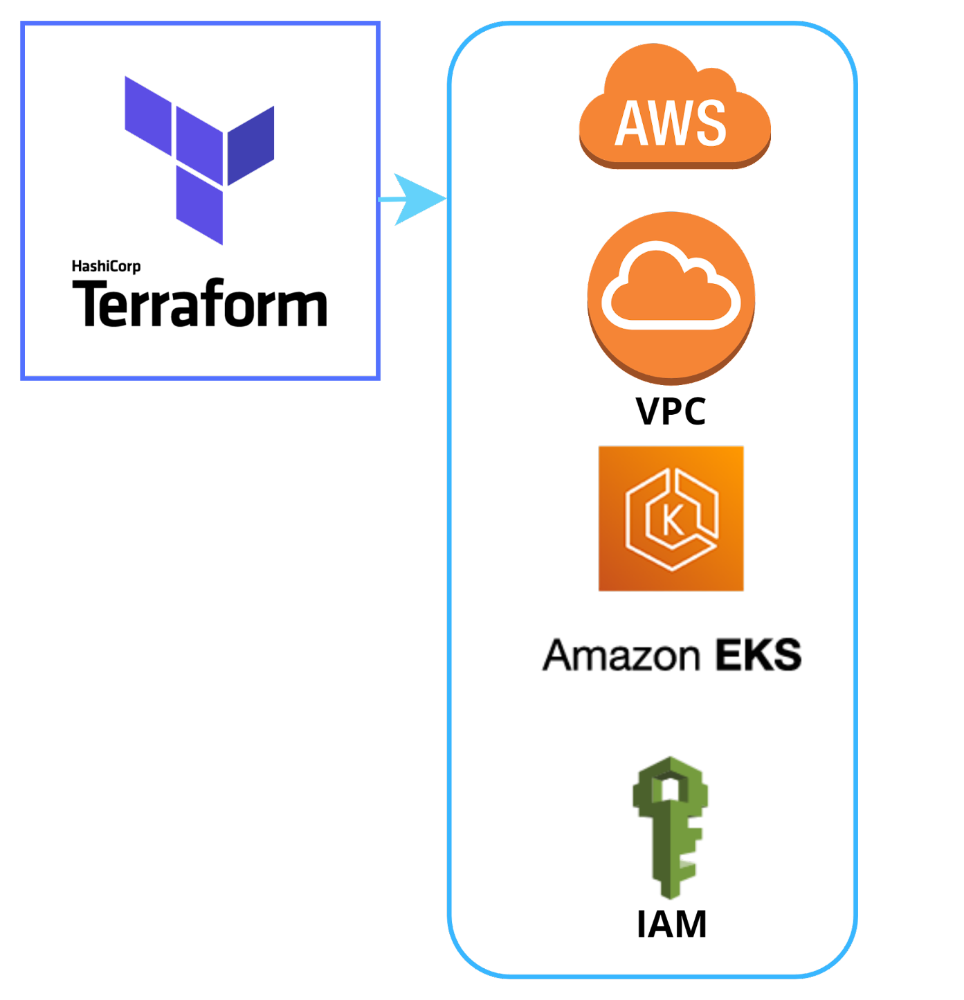

# 2206DevOps

## Welcome to the Mehrab's 2206 DevOps team!

<!--<p align="center"></p> -->

<!-- You have been brought into a scenario where our entire DevOps team just vanished over night. ~~We suspect it could be an alien abduction, since some of our engineers brought up UFO sightings in the stand-ups last week~~ (_Needs peer review_). -->

### Project Scope

Using Terraform, build an auto-scaling Kubernetes cluster with an ingress load balancer. \
Simple Terraform template to start AWS EKS cluster with ingress-nginx controller \
Optional Monitoring & S3 Bucket Configuration Included

### Your Goal

We are planning for the big release of our **E Commerce Application** by end of the day

The Client's DevOps team were working day and night to get this application onto a CICD pipeline but, unfortunately they couldnt complete it, which is where you come in!

## Listed below are your next steps!

### Onboard our flagship application onto the CICD pipeline

**Status:** In-progress

<!-- **Application Code:** <https://github.com/DevOpsTestLab/sample-spring-boot> -->
**Application Code:**

- <https://github.com/revature-rss-mehrab-1380/e-commerce-backend>
- <https://github.com/revature-rss-mehrab-1380/e-commerce-frontend>

**Description:**

The DevOps team picked up this work as part of the CICD onboarding but, unfortunately they couldn't complete it.

Below is the block diagram of how the pipeline should look like. _The blocks in RED needs your attention._

<p align="center"></p>

<p align="center"></p>

## Below is the list of tasks where your help is required:

```sh
# git clone https://github.com/webmastersmith/terraform_aws_eks.git
git clone https://github.com/ChrisBarnes2000-Revature/AWS_EKS.git
cd AWS_EKS
```

1. You must have `aws` installed:

```sh
aws sts get-caller-identity  # make sure your NOT 2206-devops-user

# if your 2206-devops-user, reset credentials
aws configure
# To get new aws credentials, login / click on your name / security credentials / access keys / create new access key.
```

2. Install Terraform

```sh
# you should make ssh files
mkdir .ssh && ssh-keygen -t rsa -f ./.ssh/id_rsa

# https://www.terraform.io/downloads
# I had problems with their keyring. Install from binary:
sudo apt-get install -y tar unzip
curl -o /tmp/terraform.zip -LO https://releases.hashicorp.com/terraform/1.2.6/terraform_1.2.6_linux_amd64.zip
unzip /tmp/terraform.zip
chmod +x terraform && mv terraform $HOME/.local/bin/

# if $HOME/.local/bin does not exist
# mkdir -p $HOME/.local/bin
# add terraform to $PATH
# export PATH=$PATH:$HOME/.local/bin

# check if terraform in $PATH
terraform

#######
## For Extra proficeny add these aliases
#######

# Download & initialize modules from terraform configuration
alias TI="terraform init -no-color |& tee Output.log && echo "---" >> Output.log"

# Validate terraform configuration
alias TV="terraform validate -no-color |& tee -a Output.log && echo "---" >> Output.log"

# Create terraform plan - Dry run to find errors
alias TP="terraform plan -out state.tfplan -var-file=secrets.tfvars -no-color |& tee -a Output.log && echo "---" >> Output.log"
# Apply terraform plan -- will make the cluster & modules
alias TAP="terraform apply state.tfplan -no-color |& tee -a Output.log && echo "---" >> Output.log"

# Apply terraform Configuration without plan -- will make the cluster & modules
alias TAA="terraform apply -var-file=secrets.tfvars -no-color -auto-approve |& tee -a Output.log && echo "---" >> Output.log"

# Destroy all terraform infrastructure
alias TD="terraform destroy -var-file=secrets.tfvars -no-color -auto-approve |& tee -a Output.log"

# Remove all terraform infrastructure
alias TR="rm Output.log && rm -rf .terraform && rm .terraform.lock.hcl && rm terraform.tfstate"

# Deploy Nginx-Ingress Load-Balancer
alias Nginx-Ingress="kubectl create ns nginx && helm repo add ingress-nginx https://kubernetes.github.io/ingress-nginx && helm repo update && helm upgrade --install ingress-nginx-chart ingress-nginx/ingress-nginx --version 4.2.0 -n nginx && kubectl --namespace nginx get services -o wide -w ingress-nginx-chart-controller"

# Deploy Jenkins Server
alias Jenkins-Helm="kubectl create ns jenkins && helm repo add jenkins https://charts.jenkins.io && helm repo update && helm upgrade --install jenkins jenkins/jenkins --version 4.1.14 -n jenkins -f jenkins/jenkins.yaml && kubectl exec --namespace jenkins -it svc/jenkins -c jenkins -- /bin/cat /run/secrets/additional/chart-admin-password && echo"
```

<p align="center"></p>

<p align="center"></p>

<p align="center"></p>

3. Add your info in the terraform `secrefts.tfvars` file.

```sh
cp sample-secrets.tfvars secrets.tfvars

# Then Adjust The Values As Your Desire.
```

4. Run terraform

```sh
# Download & initialize modules from terraform configuration
terraform init
# Validate terraform configuration
terraform validate
# Create terraform plan - Dry run to find errors
terraform plan -out state.tfplan
# Apply terraform plan -- will make the infrastructure (cluster, modules, & Pods) on aws.
terraform apply state.tfplan
```

5. Get kubeconfig file from aws

```sh
aws eks update-kubeconfig --name CLUSTER_NAME

# check if you have access to cluster
aws eks list-clusters
```

6. Install Nginx & Jenkins

```sh
# install nginx in it's own namespace
# https://artifacthub.io/packages/helm/ingress-nginx/ingress-nginx
kubectl create ns nginx
helm repo add ingress-nginx-chart ingress-nginx/ingress-nginx
helm repo update
helm upgrade --install ingress-nginx-chart ingress-nginx/ingress-nginx --version 4.2.0 -n nginx
# aws ingress setup takes a few minutes.
kubectl --namespace nginx get services -o wide -w ingress-nginx-chart-controller
# going to the aws address should return 404 not found. You know endpoint is working and ingress controller is responding.
# paste address into browser or curl -i http://YOUR-ADDRESS-us-east-1.elb.amazonaws.com

# install jenkins in it's own namespace
# https://artifacthub.io/packages/helm/jenkinsci/jenkins
# add your awsAddress to the jenkins/jenkins.yaml
#   jenkinsUrl: http://REDACTED-1903214843.us-east-1.elb.amazonaws.com/jenkins
kubectl create ns jenkins
helm repo add jenkins jenkins/jenkins
helm repo update
helm upgrade --install jenkins jenkins/jenkins --version 4.1.13 -n jenkins -f jenkins/jenkins.yaml
# get password.  user is 'admin'  Route: awsAddress/jenkins
kubectl exec --namespace jenkins -it svc/jenkins -c jenkins -- /bin/cat /run/secrets/additional/chart-admin-password && echo
# login and update plugins. restart
```

<p align="center"></p>

<p align="center"></p>

<p align="center"></p>

<p align="center"></p>

<p align="center"></p>

7. Install Monitoring Tools (optional)

```sh
# Add thes usernames & passwords To:
  # Lines 91-92 in `configMap_grafana-agent`
  #       35-56 in `configMap_grafana-agent-logs`
  #       51-52 in `configMap_grafana-agent-jenkins`
  # username: 2***********6
  # password: eyJ*****4NX0=

  # Lines 20-21           in `configMap_grafana-agent`
  #       20-21 & 26-7    in `configMap_grafana-agent-logs`
  #       19-20 & 42-3    in `configMap_grafana-agent-jenkins`
  # username: 5***********2
  # password: eyJ*****4NX0=

# For proper permissions to run a script use
# `chmod +x Script-Name.sh` (as/if needed)
./monitor/Intsall_All.sh
```

<p align="center"></p>

8. Install Apps (optional)

```sh
# install apps
kubectl create ns app
# Routes: awsAddress/apple, awsAddress/banana
kubectl apply -f apps/apple-banana.yaml -n app
# Route: awsAddress/flask
kubectl apply -f apps/flask.yaml -n app
# Routes: awsAddress/tea, awsAddress/coffee
kubectl apply -f apps/tea-coffee.yaml -n app
# check ingress
kubectl describe ingress -n app


# Name:             ab-ingress
# Labels:           <none>
# Namespace:        app
# Address:          REDACTED-1924653928.us-east-1.elb.amazonaws.com
# Ingress Class:    nginx
# Default backend:  <default>
# Rules:
#   Host        Path  Backends
#   ----        ----  --------
#   *
#               /apple    apple-service:5678 (10.0.2.228:5678)
#               /banana   banana-service:5678 (10.0.2.9:5678)
# Annotations:  ingressClassName: nginx
# Events:
#   Type    Reason  Age                    From                      Message
#   ----    ------  ----                   ----                      -------
#   Normal  Sync    4m36s (x2 over 4m57s)  nginx-ingress-controller  Scheduled for sync


# Name:             cafe-ingress
# Labels:           <none>
# Namespace:        app
# Address:          REDACTED-1924653928.us-east-1.elb.amazonaws.com
# Ingress Class:    nginx
# Default backend:  <default>
# Rules:
#   Host        Path  Backends
#   ----        ----  --------
#   *
#               /coffee   coffee-svc:80 (10.0.2.213:80,10.0.2.32:80)
#               /tea      tea-svc:80 (10.0.2.11:80,10.0.2.190:80,10.0.2.215:80)
# Annotations:  ingressClassName: nginx
#               nginx.ingress.kubernetes.io/rewrite-target: /
# Events:
#   Type    Reason  Age                    From                      Message
#   ----    ------  ----                   ----                      -------
#   Normal  Sync    2m37s (x2 over 3m36s)  nginx-ingress-controller  Scheduled for sync


# Name:             flask-ingress
# Labels:           <none>
# Namespace:        app
# Address:          REDACTED.us-east-1.elb.amazonaws.com
# Ingress Class:    nginx
# Default backend:  <default>
# Rules:
#   Host        Path  Backends
#   ----        ----  --------
#   *
#               /flask   flask-service:80 (10.0.2.105:5000)
# Annotations:  ingressClassName: nginx
# Events:
#   Type    Reason  Age                    From                      Message
#   ----    ------  ----                   ----                      -------
#   Normal  Sync    3m37s (x2 over 3m46s)  nginx-ingress-controller  Scheduled for sync
```

<p align="center"></p>

9. Destroy Cluster

```sh
# Remove helm items:
helm uninstall ingress-nginx-chart -n nginx
helm uninstall jenkins -n jenkins

# Remove namespaces and all content
kubectl delete ns nginx
kubectl delete ns jenkins
kubectl delete ns app

# Destroy all terraform infrastructure
terraform destroy --auto-approve
```

10. Double check all items destroyed. # The dashboard's should be zero. Use the search bar at top of screen.

- ec2
- eks  # cluster should empty
- vpc  # DHCP option sets will show 1. It's the dns service offered by aws and does not cost any money.

## Inspiration

- <https://github.com/DevOpsTestLab/DevOpsNinjas>
- [**learn-terraform-by-deploying-jenkins-server-on-aws**](https://www.freecodecamp.org/news/learn-terraform-by-deploying-jenkins-server-on-aws/)

## Resources

- Ashish Patel's [Github](https://github.com/a-patel) & [Medium](https://iamaashishpatel.medium.com/)

  ---

- [Darin Pope - Youtube](https://youtu.be/3H9eNIf9KZs)
- [Darin Pope - Github](https://gist.github.com/darinpope/1c8422fb7512411760ccb2827d82613f)

  ---

- [Marcel Dempers - Youtube](https://youtu.be/YDtuwlNTzRc)
- [Marcel Dempers - Github](https://github.com/marcel-dempers/docker-development-youtube-series/tree/master/monitoring/prometheus/kubernetes/1.23)


<!-- ### Task 1: Spin-up our CICD infrastructure

> Description: We will be using Jenkins as our CICD tool. Here is the link to our Jenkins repo, <https://github.com/DevOpsTestLab/jenkins>.
This Jenkins repo will have all the required Terraform files needed to deploy a Jenkins server on an EC2 instance. Here are the things for you to consider,

1. Setup your bucket, statefiles and required IAM roles and policies on AWS
2. Update your bucket and statefile names in the TF files - <https://github.com/DevOpsTestLab/jenkins/blob/main/main.tf#L7-L8>
3. Setup your private key pair - <https://github.com/DevOpsTestLab/jenkins/blob/main/ec2.tf>
4. Run the terraform plan and apply from your local or any other instance where you are running terraform from
5. The Jenkins [initial admin password](https://www.jenkins.io/doc/book/installing/linux/#unlocking-jenkins) should be available on your terraform output prompt, refer, <https://github.com/DevOpsTestLab/jenkins/blob/main/ec2.tf#L21>
6. Once the Terraform provisioning completes, open the public IP with the right port number
7. Install suggested plugins and create a initial user to get started with the next task
8. Install the following plugins as they are bare minimum to get you started,
    - <https://plugins.jenkins.io/docker-plugin/>
    - <https://plugins.jenkins.io/docker-workflow/>

> **Note**: Based on the latest update we have from our DevOps team(Before they vanished), this instance may not be fully ready, we know it spins up successfully.However, you may still have to modify any configuration, install plugins, create new configurations, add credentials to support our new onboarding initiative.

***

### Task 2: Setup a new multi-branch pipeline job for our hello world app

> Description: Here is our flagship application which needs to be onboarded, <https://github.com/DevOpsTestLab/sample-spring-boot>. Fork this repository under your own github account so that you can work on it independently. You should see the `Jenkinfile` as part of the repository which our DevOps team created. Its developed in springboot and gradle is used as the build automation tool. Create a multi-branch pipeline project in our Jenkins instance and confirm that the build is successful. Although not a top priority, you can ensure that each build is also running Unit tests and creating coverage report to use in sonarqube.
>
> **Note**: Feel free to install any plugin in Jenkins to make this work. Set-up GITHUB credentials in Jenkins so that it can checkout and perform the build.

***

### Task 3: Setup sonarqube scan for this project

> Description: We would like to get visibility on our code quality. Please integrate sonarqube in our pipeline. Here are the details below of our sonarqube server, <https://sonarcloud.io/>. Please integrate your GITHUB account with sonarcloud and create an organization. Update the `Jenkinsfile` to include a new stage called `sonarqube` and add the logic to scan the project. You may have already seen that the devops team has used [docker pipeline](https://www.jenkins.io/doc/book/pipeline/docker/) to use docker containers as our execution environment. Please stick to the same approach if possible.
>
> **Note**: Please make sure that you dont interfere with the ongoing development on the master branch. Follow branching and merging strategies as much as possible. The multi-branch pipeline will spin up automated jobs for each new branch you create. Feel free to look up in dockerhub for any docker images that you can find to use as the execution environment.
>
> Here are some useful links,

- <https://sonarcloud.io/documentation/analysis/analysis-parameters/>
- <https://docs.sonarqube.org/latest/analysis/scan/sonarscanner-for-jenkins/>

***

### Task 4: Setup docker build and docker push

> Description: Based on the latest update from the DevOps team, one of the engineers was "working" on containerzing the application. You should see a `Dockerfile` in the repo. We were told that the docker build was failing with the `COPY` step, troubleshoot the same and integrate it in the pipeline. Add a new stage for docker build and docker push to the docker hub. You may have already seen that the devops team has used [docker pipeline](https://www.jenkins.io/doc/book/pipeline/docker/) to use docker containers as our execution environment. Please stick to the same approach if possible.
>
> **Note**: Please make sure to not interfere with the ongoing development on the master branch. Follow branching and merging strategies as much as possible. The multi-branch pipeline will spin up automated jobs for each new branch you create. Feel free to look up in dockerhub for any docker images that you can find to use as the execution environment. You can use your personal credentials to perform the docker push from Jenkins. Make sure to not put your credentials in clear text. Tag the docker images along with the Jenkins build number. Feel free to install any plugins as required.

***

### Task 5: Setup Application deployment onto your EKS cluster

> Description: Based on the latest update from the DevOps team, one of the engineers was "working" on creating the manifest file(`kubernetes.yml`) for our application. You should see a `kubernetes.yml` in the repo. **Review the file carefully**, it should have a deployment and the service definitions. Make any changes to it in-order to support this deployment. Setup a new stage in `Jenkinsfile` for App deployment and implement the deployment to your EKS Cluster.
>
> **Note**: Please make sure to not interfere with the ongoing development on the master branch. Follow branching and merging strategies as much as possible. The multi-branch pipeline will spin up automated jobs for each new branch you create. Feel free to look up in dockerhub for any docker images that you can find to use as the execution environment. For this you would need an execution environment with kubectl in it. You can use the <https://plugins.jenkins.io/kubernetes-cd/> plugin for this, but its really up to you! Innovate and Improvise wherever possible!

-->


### Other Resources

- Kubernetes

  - [Kubernetes (K8s) Overview](https://medium.com/devops-mojo/kubernetes-k8s-overview-what-is-kubernetes-why-kubernetes-introduction-to-kubernetes-da92ee11c8fb)
  - [Kubernetes — Ingress Overview](https://medium.com/devops-mojo/kubernetes-ingress-overview-what-is-kubernetes-ingress-introduction-to-k8s-ingress-b0f81525ffe2)
  - [Kubernetes — Services Overview](https://medium.com/devops-mojo/kubernetes-services-overview-k8s-service-introduction-why-and-what-are-kubernetes-services-how-works-e6fd4fd4a51a)
  - [Kubernetes — Architecture Overview](https://medium.com/devops-mojo/kubernetes-architecture-overview-introduction-to-k8s-architecture-and-understanding-k8s-cluster-components-90e11eb34ccd)
  - [Kubernetes — Service Types Overview](https://medium.com/devops-mojo/kubernetes-service-types-overview-introduction-to-k8s-service-types-what-are-types-of-kubernetes-services-ea6db72c3f8c)
  - [Kubernetes — Objects (Resources/Kinds) Overview](https://medium.com/devops-mojo/kubernetes-objects-resources-overview-introduction-understanding-kubernetes-objects-24d7b47bb018)
  - [Kubernetes — Role-Based Access Control (RBAC) Overview](https://medium.com/devops-mojo/kubernetes-role-based-access-control-rbac-overview-introduction-rbac-with-kubernetes-what-is-2004d13195df)
  - [Kubernetes — Storage Overview — PV, PVC and Storage Class](https://medium.com/devops-mojo/kubernetes-storage-options-overview-persistent-volumes-pv-claims-pvc-and-storageclass-sc-k8s-storage-df71ca0fccc3)
  - [Kubernetes — Probes (Liveness, Readiness, and Startup) Overview](https://medium.com/devops-mojo/kubernetes-probes-liveness-readiness-startup-overview-introduction-to-probes-types-configure-health-checks-206ff7c24487)
  - [Kubernetes — Difference between Deployment and StatefulSet in K8s](https://medium.com/devops-mojo/kubernetes-difference-between-deployment-and-statefulset-in-k8s-deployments-vs-statefulsets-855f9e897091)

- AWS

  - [AWS — Organizations Overview](https://medium.com/awesome-cloud/aws-organizations-overview-introduction-to-what-is-aws-organization-multi-accounts-consolidated-billing-5009efc42b07)
  - [AWS — VPC Route Table Overview](https://medium.com/awesome-cloud/aws-vpc-route-table-overview-intro-getting-started-guide-5b5d65ec875f)
  - [AWS — Amazon RDS Proxy Overview](https://medium.com/awesome-cloud/aws-amazon-rds-proxy-overview-introduction-to-amazon-rds-proxy-what-is-aws-rds-proxy-b7d29b2a83c2)
  - [AWS — Amazon ElastiCache Overview](https://medium.com/awesome-cloud/aws-amazon-elasticache-overview-introduction-to-aws-elasticache-for-redis-memcached-f7165c3c2e5f)
  - [AWS — Amazon EKS vs ECS — Comparison](https://medium.com/awesome-cloud/aws-amazon-eks-vs-amazon-ecs-comparison-difference-between-eks-and-ecs-7451abd23859)
  - [AWS — Network Load Balancer (NLB) Overview](https://medium.com/awesome-cloud/aws-network-load-balancer-nlb-overview-introduction-to-amazon-nlb-what-is-aws-nlb-elb-837749c20063)
  - [AWS — Elastic Load Balancer (ELB) Overview](https://medium.com/awesome-cloud/aws-elastic-load-balancer-elb-overview-introduction-to-aws-elb-alb-nlb-gwlb-e2820fe8fe27)
  - [AWS — Application Load Balancer (ALB) Overview](https://medium.com/awesome-cloud/aws-application-load-balancer-alb-overview-introduction-to-amazon-alb-what-is-aws-alb-b5280f625153)
  - [AWS — Amazon RDS vs Amazon EC2 Relational Databases — Comparison](https://medium.com/awesome-cloud/aws-amazon-rds-vs-amazon-ec2-relational-databases-comparison-b28eb0802355)
  - [AWS — Difference between Application load balancer (ALB) and Network load balancer (NLB)](https://medium.com/awesome-cloud/aws-difference-between-application-load-balancer-and-network-load-balancer-cb8b6cd296a4)

- Terraform

  - [Terraform — Overview](https://medium.com/devops-mojo/terraform-overview-introduction-to-terraform-what-is-terraform-843bf65b83fb)
  - [Terraform — Best Practices](https://medium.com/devops-mojo/terraform-best-practices-top-best-practices-for-terraform-configuration-style-formatting-structure-66b8d938f00c)
  - [Terraform — Workspaces Overview](https://medium.com/devops-mojo/terraform-workspaces-overview-what-is-terraform-workspace-introduction-getting-started-519848392724)
  - [Terraform — Remote States Overview](https://medium.com/devops-mojo/terraform-remote-states-overview-what-is-terraform-remote-state-storage-introduction-936223a0e9d0)
  - [Terraform — Provision Amazon EKS Cluster using Terraform](https://medium.com/devops-mojo/terraform-provision-amazon-eks-cluster-using-terraform-deploy-create-aws-eks-kubernetes-cluster-tf-4134ab22c594)

- Other Other

  - [Prometheus — Overview](https://medium.com/devops-mojo/prometheus-overview-what-is-prometheus-introduction-92e064cff606)
  - [Helm — Helm Charts Overview](https://medium.com/devops-mojo/helm-charts-overview-introduction-to-helm-101-ef6296ecff87)

  - [aws_eks_cluster.this](https://registry.terraform.io/providers/hashicorp/aws/latest/docs/data-sources/eks_cluster)
  - [aws_eks_cluster_auth.this](https://registry.terraform.io/providers/hashicorp/aws/latest/docs/data-sources/eks_cluster_auth)

  - [terraform-aws-eks-prometheus-node-exporter](https://github.com/lablabs/terraform-aws-eks-prometheus-node-exporter)
  - [terraform-aws-eks-kube-state-metrics](https://github.com/lablabs/terraform-aws-eks-kube-state-metrics)

  - [terraform-provider-helm/issues/893](https://github.com/hashicorp/terraform-provider-helm/issues/893)
  - [kubernetes/ingress-nginx-values.yaml](https://github.com/kubernetes/ingress-nginx/blob/main/charts/ingress-nginx/values.yaml)

  - <https://grafana.com/docs/agent/latest/configuration>
  - <https://github.com/kubernetes/kube-state-metrics>
  - <https://github.com/grafana/agent>
  - Jenkins Integration:

    - <https://plugins.jenkins.io/prometheus>
    - <https://plugins.jenkins.io/cloudbees-disk-usage-simple>
    - <https://grafana.com/docs/grafana-cloud/data-configuration/integrations/integration-reference/integration-jenkins>
